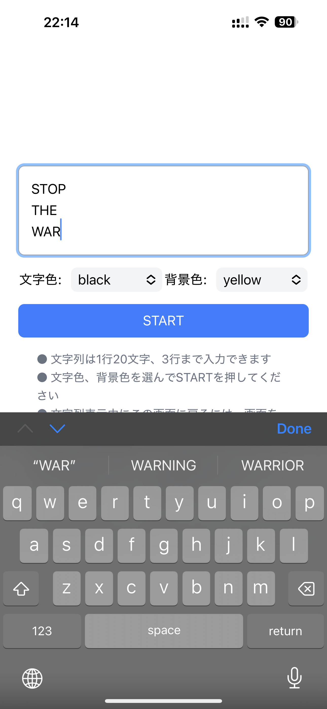
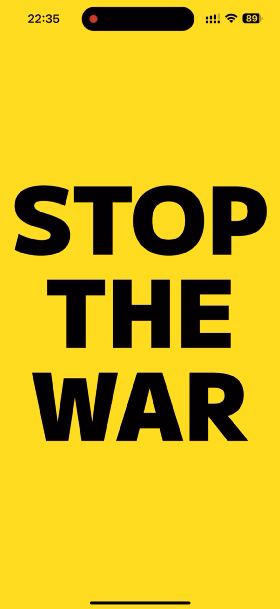
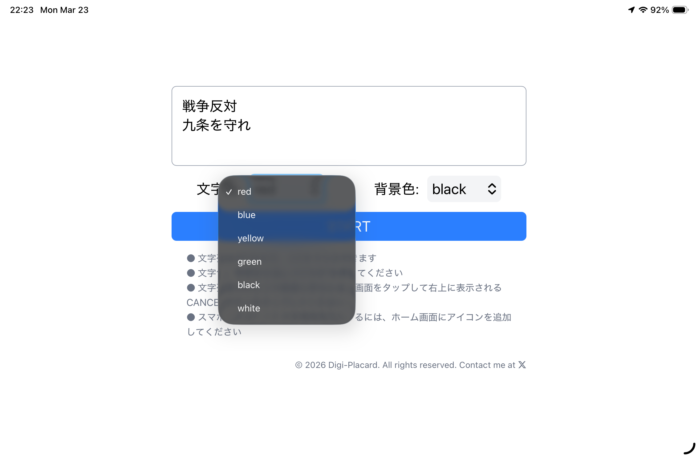
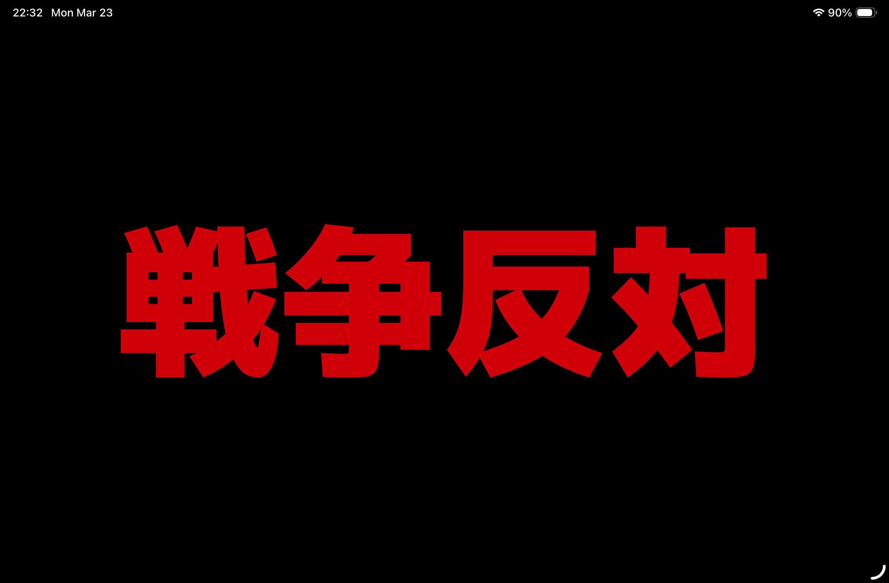

# Digi-Placard

## Live[↗️](https://digi-placard.kellybytes.dev "Digi-Placard")

React + Tailwind CSSで作ったデジタルプラカードです。タブレットやスマホで一度アクセスすればオフラインで動きます。

## 使い方
- 文字列は1行20文字、3行まで入力できます
- 文字色、背景色を選んでSTARTを押してください
- 文字列表示中に設定画面に戻るには、画面をタップして右上に表示されるCANCELボタンをタップしてください
- スマホ・タブレットで全画面表示にするには、ホーム画面にアイコンを追加してください

## スクリーンショット

  
  

 

  
  

