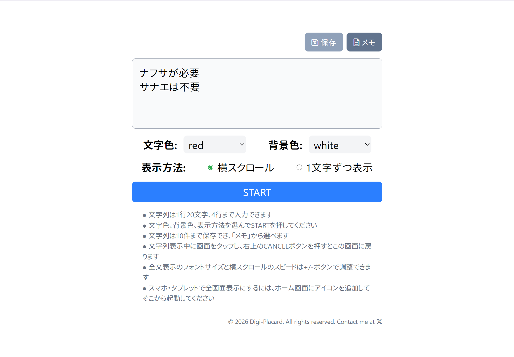

# Digi-Placard

## Live[↗️](https://digi-placard.kellybytes.dev 'Digi-Placard')

React + Tailwind CSSで作ったデジタルプラカードです。入力した文字列を1文字ずつ表示／横スクロール⇔全文表示を繰り返します。**タブレットやスマホでは一度アクセスすればオフラインでも使えます。**

## 使い方

- 文字列は1行20文字、4行まで入力できます
- 文字色、背景色、表示方法を選んでSTARTを押してください
- 文字列は10件まで保存でき、「メモ」から選べます
- 文字列表示中に画面をタップし、右上のCANCELボタンを押すとこの画面に戻ります
- 全文表示のフォントサイズと横スクロールのスピードは+/-ボタンで調整できます
- スマホ・タブレットで全画面表示にするには、ホーム画面にアイコンを追加してそこから起動してください

## スクリーンショット

  
初期画面 & 表示画面

  
  

 

  
  
  

---

### 変更履歴

2026-04-16

- 横スクロールモード(スピード調整可)追加
- 文字列メモ機能を追加
- 入力画面、モーダルをリファクタリング

2026-03-26

- Antonフォント追加 (アルファベット用)
- フォントサイズ変更ボタン追加
- 入力可能な行を3行から4行へ変更
- 文字色に虹色を追加

2026-03-23

- 公開
